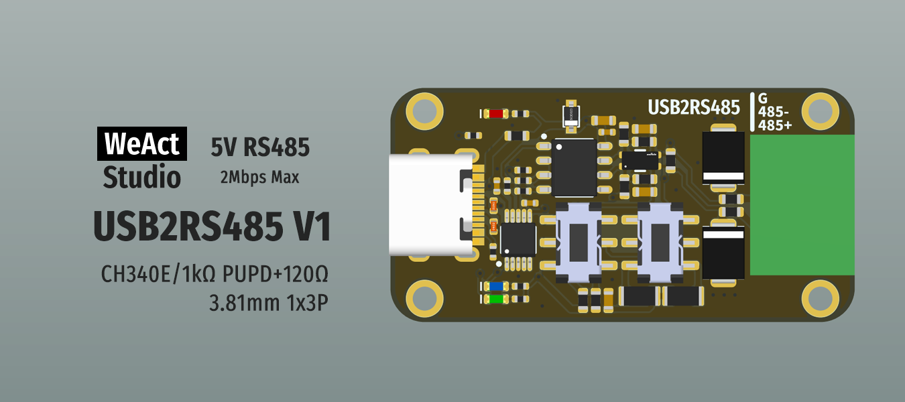

* [中文版本](./README_zh.md)
# WeActStudio.USB2RS485V1

CH340E
> Full speed USB device interface, compatible with USB 2.0.  
Support communication baud rate `50bps~2Mbps`.

RS485
> Maximum rate of 2Mbps, 5V level, 1kΩ pull-down + pull-down and 120Ω terminal matching resistor can be set

Connector   
> 3.81mm 1x3P 15EDGK-3.81-3P

## Drive installation
See `Drivers` folder

```
/*---------------------------------------
- WeAct Studio Official Link
- taobao: weactstudio.taobao.com
- aliexpress: weactstudio.aliexpress.com
- github: github.com/WeActStudio
- gitee: gitee.com/WeAct-TC
- blog: www.weact-tc.cn
---------------------------------------*/
```